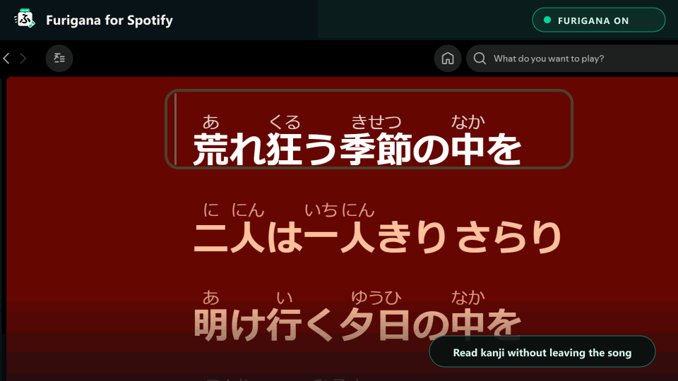

<p align="center">
  <a href="../README.md">English</a> · <a href="./README.zh-CN.md">简体中文</a> · <strong>日本語</strong>
</p>

<p align="center">
  
</p>

<h1 align="center">Furigana for Spotify</h1>

<p align="center">
  <strong>Windows版Spotifyの歌詞に、ひらがな・カタカナ・ローマ字の読みをリアルタイム表示。</strong>
  <br />
  ローカル処理 · 歌詞API不要 · 歌詞を外部送信しない
</p>

<p align="center">
  <a href="https://github.com/huiishan99/spotify-furigana/actions/workflows/ci.yml"></a>
  <a href="https://github.com/huiishan99/spotify-furigana/releases/latest"></a>
  <a href="https://github.com/huiishan99/spotify-furigana/stargazers"></a>
  
  
  
  <a href="../LICENSE"></a>
</p>

> [!IMPORTANT]
> 本プロジェクトは独立したコミュニティプロジェクトであり、Spotify ABとは関係がなく、同社による後援・承認も受けていません。プロジェクト独自のロゴにはSpotify公式ロゴを使用していません。互換性バッジ内のマークは対象プラットフォームを示すためだけに使用しています。

> [!TIP]
> このプロジェクトで一曲でも読みやすくなったら、ぜひ[Starを付けてください](https://github.com/huiishan99/spotify-furigana)。Starは、ほかの日本語学習者がプロジェクトを見つける助けになります。

## 動作イメージ

<p align="center">
  
</p>

<p align="center">
  <sub>実機環境から作成：Windows 11 · Spotify 1.2.96.518 · Spicetify 2.44.0。<a href="../assets/screenshots/lyrics-view.png">全体のスクリーンショットを見る。</a>歌詞、アートワーク、SpotifyのUI要素に関する権利は各権利者に帰属し、この画像は拡張機能の動作を説明する目的でのみ掲載しています。</sub>
</p>

Spotifyがすでに表示している歌詞を拡張し、漢字に標準HTMLの `<ruby>` を使ってふりがなを追加します。

| 元の歌詞 | ふりがな表示後 |
| --- | --- |
| 声も聞かさないで | <ruby>声<rt>こえ</rt></ruby>も<ruby>聞<rt>き</rt></ruby>かさないで |
| 明日は晴れる | <ruby>明日<rt>あした</rt></ruby>は<ruby>晴<rt>は</rt></ruby>れる |

## 特長

- **Spotifyの歌詞画面をそのまま拡張**：現在のデスクトップ歌詞画面を自動処理し、既知の全画面レイアウトにも対応します。
- **完全ローカル処理**：Kuroshiro + Kuromojiが端末上で形態素解析と読み変換を行います。
- **表示を自由に調整**：ひらがな・カタカナ・ローマ字を切り替え、サイズ、透明度、上下の間隔を調整できます。
- **歌詞ソースを置き換えない**：Spotifyに表示済みのテキストだけを拡張し、歌詞の取得、保存、再配布は行いません。
- **いつでも切り替え可能**：プレーヤー下部の歌詞ボタン、またはサイドバーのカスタムアプリ画面からオン・オフできます。

## 必要環境

- Windows 10 または Windows 11
- Windows版Spotifyデスクトップアプリ
- [Spicetify](https://spicetify.app/docs/getting-started)

実機で確認済みの構成：

| コンポーネント | 確認済みバージョン |
| --- | --- |
| Windows | Windows 11 Pro 10.0.26200 |
| Spotify | Microsoft Store版 1.2.96.518 |
| Spicetify | 2.44.0 |

ほかのバージョンでも動作する可能性はありますが、個別の検証はまだ行っていません。

詳しいバージョン情報は[互換性マトリクス](./COMPATIBILITY.md)を参照してください。

## インストール

<p>
  <a href="https://github.com/huiishan99/spotify-furigana/releases/latest"></a>
</p>

1. [最新のRelease](https://github.com/huiishan99/spotify-furigana/releases/latest)から `spotify-furigana-vX.Y.Z.zip` をダウンロードします。
2. ZIPを完全に展開します。
3. 展開したフォルダーでPowerShellを開き、次を実行します。

```powershell
powershell -ExecutionPolicy Bypass -File .\install.ps1
```

インストーラーは既存バージョンをバックアップし、アプリのインストールと有効化、Spicetify設定の適用を行います。

Spotifyを再起動し、歌詞のある日本語の曲を再生して歌詞画面を開きます。初回変換時はローカル辞書の読み込みに少し時間がかかります。

> [!NOTE]
> Microsoft Store版Spotifyに対するSpicetifyのサポートは限定的です。通常のショートカットからプラグインが読み込まれない場合は `spicetify auto` で起動してください。`Cannot find pref_file` が表示される場合は [Spicetify FAQ](https://spicetify.app/docs/faq) を参照してください。

## 更新

最新のRelease ZIPをダウンロードして展開し、インストーラーをもう一度実行します。

```powershell
powershell -ExecutionPolicy Bypass -File .\install.ps1
```

更新前に、以前のインストールはタイムスタンプ付きのバックアップとして保存されます。

## 読み表示のカスタマイズ

Spotifyのサイドバーから **Furigana for Spotify** を開くと、次の設定を変更できます。

- ひらがな・カタカナ・ローマ字の切り替え
- 読みのサイズを30%〜75%に調整
- 透明度を40%〜100%に調整
- 上下の間隔を最大8 px追加
- ワンクリックで表示設定を初期値に戻す

設定はローカルに保存され、すぐに反映されます。

## アンインストール

```powershell
powershell -ExecutionPolicy Bypass -File .\uninstall.ps1
```

## トラブルシューティング

- **サイドバーにFuriganaページがない：**`spicetify apply` を実行し、Spotifyを再起動してください。
- **ボタンはあるが歌詞が変わらない：**漢字を含む日本語歌詞がある曲か、歌詞ボタンがオンかを確認し、初回のローカル辞書読み込みを少し待ってください。
- **Spotify更新後にアプリが消えた：**`spicetify backup apply` を実行し、Spotifyを再起動してください。
- **Microsoft Store版SpotifyでSpicetifyが読み込まれない：**`spicetify auto` での起動を試し、[Spicetify FAQ](https://spicetify.app/docs/faq)を確認してください。

## 既知の制限

- 人名、地名、言葉遊び、意図的に崩した読み方は誤って注釈される場合があります。
- Spotifyの更新によって歌詞DOMが変わる可能性があります。突然動作しなくなった場合は、SpotifyとSpicetifyのバージョンをissueに記載してください。
- 現在はWindows版Spotifyデスクトップアプリのみを対象としており、Web Player、macOS、モバイル版には対応していません。

## コントリビューション

問題やアイデアがある場合は [Issue](https://github.com/huiishan99/spotify-furigana/issues) を開いてください。Pull Requestを送る前に [CONTRIBUTING.md](../CONTRIBUTING.md) を確認してください。

セキュリティ上の問題は [SECURITY.md](../SECURITY.md) の手順に従って非公開で報告してください。

## プロジェクトを共有する

[docs/LAUNCH_KIT.md](./LAUNCH_KIT.md) に英語、中国語、日本語の投稿文を用意しています。拡張機能が役立った場合は、[GitHubでStarを付ける](https://github.com/huiishan99/spotify-furigana)か、信頼できる互換性レポートを送ってもらえると助かります。

## 商標について

Furigana for Spotifyは独立したオープンソースプロジェクトです。Spotify、Spotifyロゴ、および関連するブランド要素はSpotify ABの商標です。本プロジェクトはSpotify ABとは関係がなく、同社による後援・承認も受けていません。「for Spotify」は対応プラットフォームを説明する目的でのみ使用しています。

プロジェクトロゴは「ふ」、ルビ注釈バー、音符を組み合わせたオリジナルデザインです。黒に近い色、青みのあるエメラルドグリーン、オフホワイトによって音楽ストリーミング製品を連想できる配色にしつつ、Spotify Greenとは区別し、Spotifyの円形、波形、公式ロゴは使用していません。詳しくは [Spotify Design & Branding Guidelines](https://developer.spotify.com/documentation/design) を参照してください。

## License

[MIT](../LICENSE)
