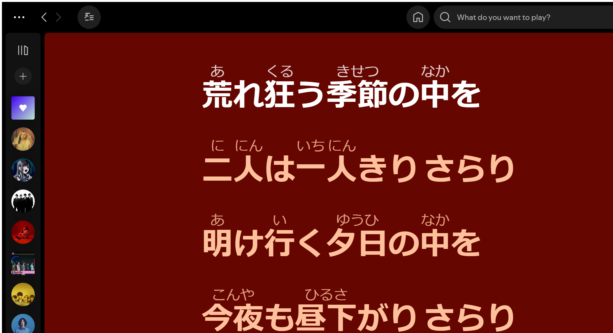

<p align="center">
  <a href="../README.md">English</a> · <a href="./README.zh-CN.md">简体中文</a> · <strong>日本語</strong>
</p>

<p align="center">
  
</p>

<h1 align="center">Furigana for Spotify</h1>

<p align="center">
  <strong>Windows版Spotifyの歌詞に、日本語の漢字のふりがなをリアルタイム表示。</strong>
  <br />
  ローカル処理 · 歌詞API不要 · 歌詞を外部送信しない
</p>

<p align="center">
  <a href="https://github.com/huiishan99/spotify-furigana/actions/workflows/ci.yml"></a>
  
  
  
  <a href="../LICENSE"></a>
</p>

> [!IMPORTANT]
> 本プロジェクトは独立したコミュニティプロジェクトであり、Spotify ABとは関係がなく、同社による後援・承認も受けていません。プロジェクト独自のロゴにはSpotify公式ロゴを使用していません。互換性バッジ内のマークは対象プラットフォームを示すためだけに使用しています。

## 動作イメージ

<p align="center">
  
</p>

<p align="center">
  <sub>実機環境：Windows 11 · Spotify 1.2.96.518 · Spicetify 2.44.0。歌詞、アートワーク、SpotifyのUI要素に関する権利は各権利者に帰属し、この画像は拡張機能の動作を説明する目的でのみ掲載しています。</sub>
</p>

Spotifyがすでに表示している歌詞を拡張し、漢字に標準HTMLの `<ruby>` を使ってふりがなを追加します。

| 元の歌詞 | ふりがな表示後 |
| --- | --- |
| 声も聞かさないで | <ruby>声<rt>こえ</rt></ruby>も<ruby>聞<rt>き</rt></ruby>かさないで |
| 明日は晴れる | <ruby>明日<rt>あした</rt></ruby>は<ruby>晴<rt>は</rt></ruby>れる |

## 特長

- **Spotifyの歌詞画面をそのまま拡張**：現在のデスクトップ歌詞画面を自動処理し、既知の全画面レイアウトにも対応します。
- **完全ローカル処理**：Kuroshiro + Kuromojiが端末上で形態素解析と読み変換を行います。
- **歌詞ソースを置き換えない**：Spotifyに表示済みのテキストだけを拡張し、歌詞の取得、保存、再配布は行いません。
- **いつでも切り替え可能**：プレーヤー下部の歌詞ボタン、またはサイドバーのカスタムアプリ画面からオン・オフできます。
- **安全なDOM挿入**：許可した `<ruby>`、`<rt>`、`<rp>` ノードだけを生成します。

## 必要環境

- Windows 10 または Windows 11
- Windows版Spotifyデスクトップアプリ
- [Spicetify](https://spicetify.app/docs/getting-started)
- Node.js 22以降（ビルド時のみ）

実機で確認済みの構成：

| コンポーネント | 確認済みバージョン |
| --- | --- |
| Windows | Windows 11 Pro 10.0.26200 |
| Spotify | Microsoft Store版 1.2.96.518 |
| Spicetify | 2.44.0 |

ほかのバージョンでも動作する可能性はありますが、個別の検証はまだ行っていません。

## インストール

### Releaseパッケージ（推奨）

1. [最新のRelease](https://github.com/huiishan99/spotify-furigana/releases/latest)から `spotify-furigana-vX.Y.Z.zip` をダウンロードします。
2. ZIPを完全に展開します。
3. 展開したフォルダーでPowerShellを開き、次を実行します。

```powershell
powershell -ExecutionPolicy Bypass -File .\install.ps1
```

Releaseにはビルド済みの拡張機能とKuromoji辞書が含まれています。インストーラーは既存バージョンをタイムスタンプ付きでバックアップしてからSpicetifyへコピーし、アプリを有効化して `spicetify apply` を実行します。

### ソースからビルド

```powershell
git clone https://github.com/huiishan99/spotify-furigana.git
Set-Location spotify-furigana
npm ci
npm run build
```

### ソースビルドをSpicetifyへインストール

```powershell
$target = Join-Path $env:APPDATA "spicetify\CustomApps\spotify-furigana"
New-Item -ItemType Directory -Force $target | Out-Null
Copy-Item -Recurse -Force "dist\spotify-furigana\*" $target

spicetify config custom_apps spotify-furigana
spicetify apply
```

Spotifyを再起動し、歌詞のある日本語の曲を再生して歌詞画面を開きます。初回変換時はローカル辞書の読み込みに少し時間がかかります。

> [!NOTE]
> Microsoft Store版Spotifyに対するSpicetifyのサポートは限定的です。通常のショートカットからプラグインが読み込まれない場合は `spicetify auto` で起動してください。`Cannot find pref_file` が表示される場合は [Spicetify FAQ](https://spicetify.app/docs/faq) を参照してください。

## 更新

```powershell
git pull
npm ci
npm run build

$target = Join-Path $env:APPDATA "spicetify\CustomApps\spotify-furigana"
Copy-Item -Recurse -Force "dist\spotify-furigana\*" $target
spicetify apply
```

## アンインストール

```powershell
spicetify config custom_apps spotify-furigana-
spicetify apply
```

## 仕組み

```text
Spotifyの歌詞DOM
        ↓
漢字を含む歌詞行を検出
        ↓
Kuroshiro + Kuromojiでローカル変換
        ↓
安全な <ruby> / <rt> 注釈を生成
```

## リポジトリ構成

```text
spotify-furigana/
├── app/          # Spicetify Custom Appの画面、スタイル、manifest
├── assets/       # プロジェクトロゴと実機スクリーンショット
├── docs/         # 中国語・日本語README
├── packaging/    # Release用インストーラー、アンインストーラー、オフライン説明
├── scripts/      # ビルドとアセットコピー用スクリプト
├── src/          # 歌詞監視、セレクター、設定、読み変換エンジン
├── tests/        # Vitestユニットテスト
├── types/        # KuroshiroとSpicetifyの型宣言
└── README.md     # 英語の標準エントリーポイント
```

主なファイル：

- `src/extension.ts`：歌詞DOMの監視、オン・オフ状態、歌詞行の更新。
- `src/lyrics.ts`：新旧Spotify歌詞レイアウト用セレクター。
- `src/reading-engine.ts`：ローカル読み変換と安全なDOM生成。
- `scripts/build.mjs`：拡張機能のバンドルとKuromoji辞書のコピー。

実行層、ソース、テスト、ビルド、型、ドキュメントがすでに分離されているため、見た目だけを目的としたソースディレクトリの移動は不要です。

## 開発

```powershell
npm ci
npm run check
npm run package
```

`npm run check` はTypeScriptチェック、Vitestテスト、プロダクションビルドを順番に実行します。`npm run package` はGit管理外の `release/` ディレクトリにインストール用ZIPとSHA-256チェックサムを生成します。

## 既知の制限

- 人名、地名、言葉遊び、意図的に崩した読み方は誤って注釈される場合があります。
- Spotifyの更新によって歌詞DOMが変わる可能性があります。突然動作しなくなった場合は、SpotifyとSpicetifyのバージョンをissueに記載してください。
- 現在はWindows版Spotifyデスクトップアプリのみを対象としており、Web Player、macOS、モバイル版には対応していません。

## ロードマップ

- [ ] ふりがなのサイズ、透明度、間隔の設定
- [ ] カタカナ・ローマ字表示モード
- [ ] ワンクリックインストール・更新スクリプト
- [ ] Spotify / Spicetifyの追加バージョン検証
- [ ] Spicetify Marketplaceへの公開

## コントリビューション

IssueとPull Requestを歓迎します。変更を送る前に、次のコマンドを実行してください。

```powershell
npm run check
```

互換性の問題を報告する場合は、Spotifyのバージョン、Spicetifyのバージョン、歌詞画面の種類、アカウント情報を含まないコンソールエラーを記載してください。歌詞全文は貼り付けないでください。

## 商標について

Furigana for Spotifyは独立したオープンソースプロジェクトです。Spotify、Spotifyロゴ、および関連するブランド要素はSpotify ABの商標です。本プロジェクトはSpotify ABとは関係がなく、同社による後援・承認も受けていません。「for Spotify」は対応プラットフォームを説明する目的でのみ使用しています。

プロジェクトロゴは「ふ」、ルビ注釈バー、音符を組み合わせたオリジナルデザインです。黒に近い色、青みのあるエメラルドグリーン、オフホワイトによって音楽ストリーミング製品を連想できる配色にしつつ、Spotify Greenとは区別し、Spotifyの円形、波形、公式ロゴは使用していません。詳しくは [Spotify Design & Branding Guidelines](https://developer.spotify.com/documentation/design) を参照してください。

## License

[MIT](../LICENSE)
